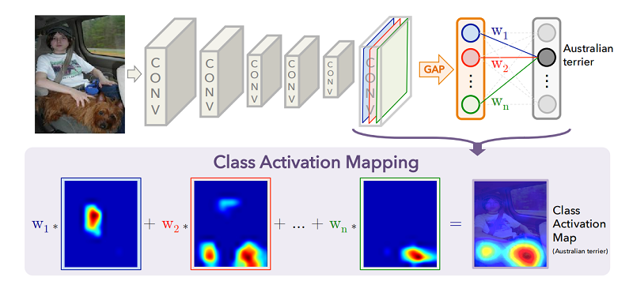
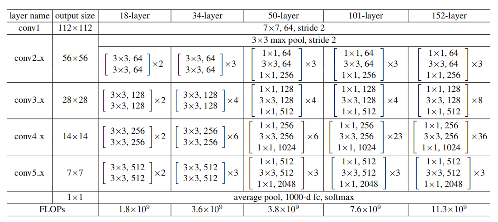
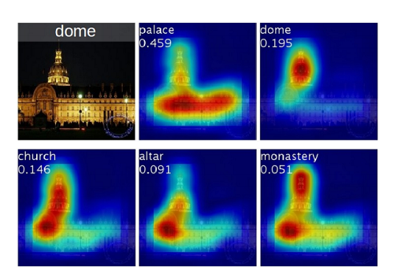

# Class Activation Map
原论文地址：<br>
https://arxiv.org/abs/1512.04150<br>
预训练ResNet-18参数下载地址：<br>
https://download.pytorch.org/models/resnet18-5c106cde.pth

## 概述
在这篇文章中，作者提出卷积神经网络（CNN）可以在**无监督**的情况下完成图像定位的任务，产生类似于热图的Class Activation Map（CAM），效果如下右图：<br>
<div align=center><br></div>

## 算法
通常CNN都是由前面的卷积层与后面的全连接层组成。一些研究已经表明，对于一个CNN来说，卷积层用来提取图像浅层与深层的结构纹理特征，而最后的全连接层则用来完成具体的计算机视觉任务，例如对图像分类，检测目标，或是语义分割等等。**只要利用前面的卷积层提取到的丰富图像特征，即可生成一张热图**。算法流程见下图：<br>
<div align=center><br></div>

### 准备工作
首先需要在ImageNet上面训练一个用于图像分类的CNN，之后利用这个CNN来生成CAM。这里我们以<b>ResNet-18</b>为例分析生成CAM的算法流程。使用如下代码可以获得一个预训练的ResNet-18：<br>

```python
def load_net():
    net = resnet18()
    model_path = "resnet18.pth"  # 这里是你存放参数的路径
    net.load_state_dict(torch.load(model_path))
    print("load pretrained resnet model successfully !")
    return net
```
ResNet-18的网络结构如下表最左边18-layer对应的那一列：<br>
<div align=center><br></div>
根据上表，ResNet-18可以分为3部分：

```
假设输入图片尺寸为224，通道为3

卷积层：[3,224,224] -> [512,7,7]                对应net.children())[:-2]
全局平均池化层（GAP）：[512,7,7] -> [512,1]      对应net.children())[-2]
全连接层：[512,1] -> [1000,1]                   对应net.children())[:-1]
```
### 预处理
提取图片，并将```PIL```格式图片转化为```torch.Tensor```类型：<br>
```python
img = Image.open(img_path)
ori_w = img.size[0]  # 原始图片宽度
ori_h = img.size[1]  # 原始图片高度

img2tensor = transforms.Compose([
    transforms.Resize((224, 224)),
    transforms.ToTensor(),
])

img_tensor = img2tensor(img)
img_tensor.unsqueeze_(dim=0)  # [3,224,224] -> [1,3,224,224]
print("load img successfully !")
```

### 第一步
将原始图片经过卷积层后得到的尺寸为 ```512*7*7``` 的feature map抽取出来：<br>

```python
net = load_net()
net.eval()
heat_map_net = nn.Sequential(*list(net.children())[:-2])  # 从完整的ResNet-18中抽取出前面的卷积层 
origin_fm = heat_map_net(img_tensor)[0]  # 获得[512,7,7]的feature map
```
### 第二步
找到输出的1000个神经元中，激活值最高的第k个神经元，并提取对应的全连接层权重存储在```weights```中，对应原论文算法流程图的```w1,w2,...,wn```：

```python
last_fc_param = list(net.parameters())[-2]  # [1000,512] 抽取出全连接层的权重
predict = net(img_tensor)
logits = torch.argmax(predict, dim=1)  
weights = torch.softmax(last_fc_param[logits], dim=0)  # [512] 获取置信度分最高的神经元对应的全连接层权重，并将其softmax归一化处理
```
### 第三步
对512张feature map加权求和：<br>
```python
res = torch.zeros((7, 7))
for i in range(512):
    res += weights[0][i] * origin_fm[i]  # 加权和
res = res / torch.max(res)
res.clamp_(0, 1)  # 可能会出现负数，因此将其clamp到[0,1]
```
### 第四步
此时的```res```即为CAM。为了做出热图的效果，还应当将```res```的大小调整到```224*224```后与原始图片做```pixel-wise```的加法，实现起来比较自然：<br>
```python
tensor2img = transforms.Compose([
        transforms.ToPILImage(),
        transforms.Resize((224, 224)),
])
heat = tensor2img(res)
res = transforms.ToTensor()(heat)  
img_tensor.squeeze_(dim=0)  # [1,1,7,7] -> [1,224,224]
res = res * 0.6 + img_tensor * 0.4  # pixel-wise加法

res = transforms.ToPILImage()(res)
res = transforms.Resize((ori_h, ori_w))(res)  # 调整为原图尺寸
res.save('cam.jpg')

# 使用cv2的colormap函数生成热图
cam = cv2.imread('cam.jpg')
hm = cv2.applyColorMap(cam, cv2.COLORMAP_JET)
cv2.imwrite('cam.jpg', hm)
```
### 回顾
此时再来回顾原论文中给出的算法流程图，应该就十分清晰了!该算法实现起来还是十分简单的，再次总结为如下几步：<br>
```
STEP0 搭建ResNet-18预训练模型；
STEP1 提取卷积层最后输出的feature map；
STEP2 前向传播，寻找对应的全连接层权重；
STEP3 加权求和，得到CAM；
STEP4 将CAM先resize，再与原图相加，得到热图的效果。
```
## 讨论
在CAM的算法中，全连接层对应的权重可以直接影响到生成的热图质量。作者使用了响应值最高的神经元对应的权重，那么如果换做别的神经元呢？作者做了如下的实验：<br>
<div align=center><br></div>
可以看到，最后的分类层中，不同的神经元权重反应到热图中，对应神经网络的注意力不同。这种<b>注意力机制</b>之后被应用到了生成模型UGATIT中，显著提高了图像翻译的质量。
